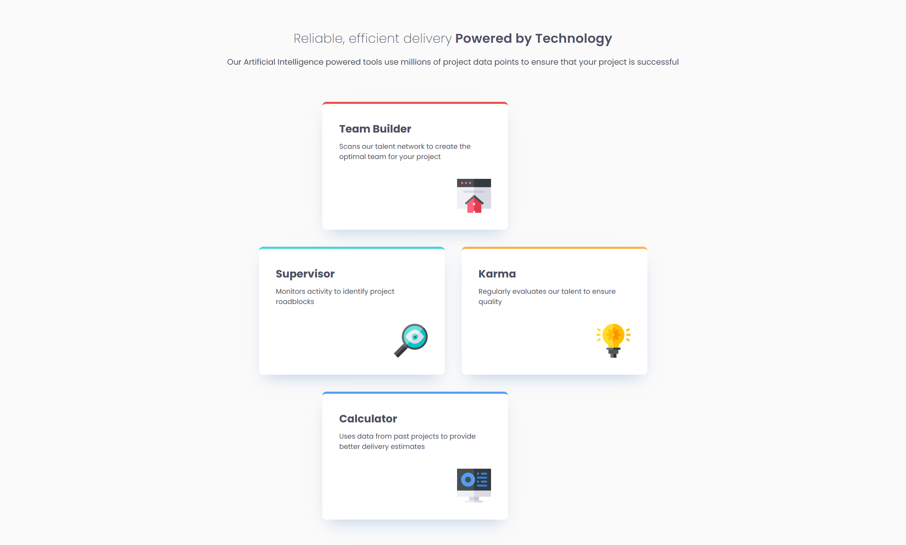

# Frontend Mentor - Four card feature section solution

This is a solution to the [Four card feature section challenge on Frontend Mentor](https://www.frontendmentor.io/challenges/four-card-feature-section-weK1eFYK). Frontend Mentor challenges help you improve your coding skills by building realistic projects.

## Table of contents

- [Overview](#overview)
  - [The challenge](#the-challenge)
  - [Screenshot](#screenshot)
  - [Links](#links)
- [My process](#my-process)
  - [Built with](#built-with)
  - [What I learned](#what-i-learned)
  - [My process notes and learnings](#learnings)
  - [Continued development](#continued-development)
- [Author](#author)

## Overview

### The challenge

Users should be able to:

- View the optimal layout for the site depending on their device's screen size

### Screenshot

#### Desktop version

#### Mobile version

### Links

- Solution URL: [Github repo](https://github.com/simeon2002/FEM-four-card-feature-section)
- Live Site URL: [Four card feature section](https://simeon2002.github.io/FEM-four-card-feature-section/)

## My process

### Built with

- Semantic HTML5 markup
- CSS custom properties
- CSS Grid
- Mobile-first workflow
- fluid typography with `clamp()`

### My process notes and takeaways

- Workflow
  - Set up github repo
  - Set up index.html
    - Keep accessibility of elements in mind
    - Provide elements for layout
  - Set up design system
    - includes:
      - colors `--color-{color}-{weight}` from color pallettes
      - Typography parameters font-weight, font-size
      - spacing scale
      - repeated values for similar properties across design
  - Style page with CSS for one viewport
    - Design principles
      - Styles should be reusable and not repeat themselves. Think about what type of style to use based on the subdivide: reusable components, specific styles, and layout & utility classes
    - Define typography styles
    - Define reset styles
    - Define styles section by section
  - Make page responsive
    - Calculate fluid typography
    - Define styles for larger viewports using responsive design principles + hybrid breakpoint setting approach (breakpoints based on tech-range + based on where design breaks)
  - Set up README with learning takeaways
- Difficulties encountered?
  - Defining fluid typography for the first time
  - Issue with width of the cards not being the same → had to define a 3x4 grid instead of 3x2 so that all cards _have the same width_.
- Questions?
  - Yes, fluid typography should be done on all text or mostly headings?
- What would you do better next time?
  - /
- Learnings/takeaways
  - Since box shadow had a repeating color, I used a css variable to not have to rewrite the long hand CSS Property, another case to use custom CSS properties here.
  - Forgot that I could use 4 grid columns to solve the width of the cards to be the same.
- Note: new rule → Centralize a value as customer property if 1) it is used across unrelated rules. (e.g. font-size, section padding) 2) it is likely to change value (e.g. colors or type scale). Values that are element-specific stay hardcoded.

### Continued development

Learn more responsiveness tactics. Applied fluid typography in the project.

## Author

- Frontend Mentor - [@simeon2002](https://www.frontendmentor.io/profile/simeon2002)
- Twitter - [@SimeonSeraf1mov](https://x.com/SimeonSeraf1mov)
